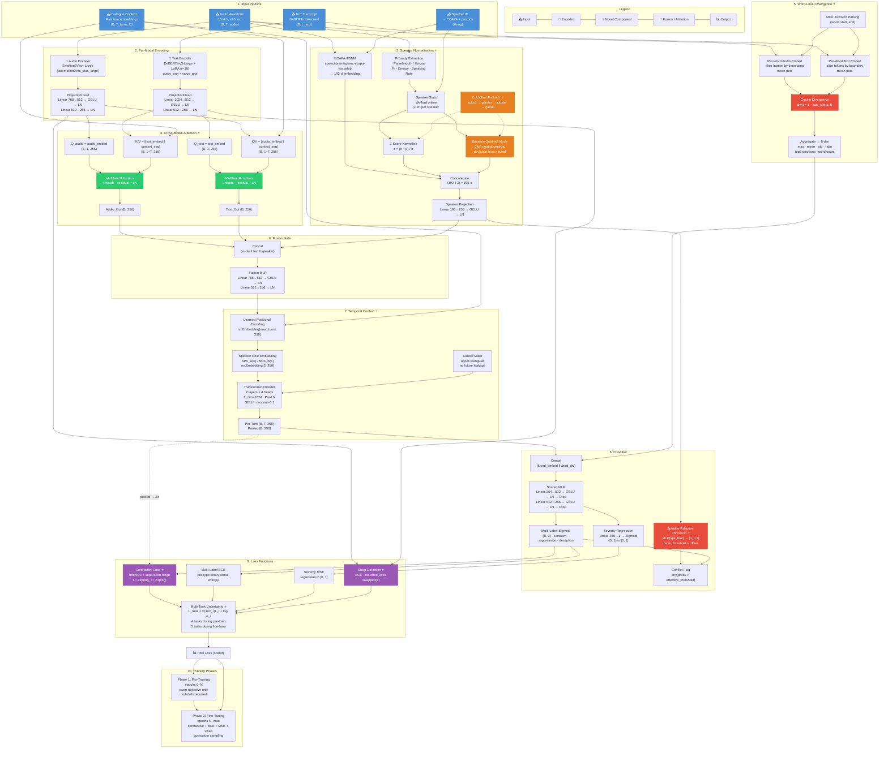

# ConflictNet v2 — Architecture Reference

> **Speaker-Invariant Multimodal Detection of Emotional Conflict in Speech**
>
> Detects three conflict subtypes — **sarcasm**, **suppression**, **deception** — defined as the
> measurable divergence between a speaker's lexical content (text) and their vocal prosody (audio),
> while remaining invariant to speaker identity through a novel normalisation pipeline.

---

## Table of Contents

1. [System Overview](#1-system-overview)
2. [Architecture Flowchart](#2-architecture-flowchart)
3. [Input Pipeline](#3-input-pipeline)
4. [Per-Modal Encoding](#4-per-modal-encoding)
5. [Speaker Normalisation](#5-speaker-normalisation)
6. [Cross-Modal Attention](#6-cross-modal-attention)
7. [Fusion Gate](#7-fusion-gate)
8. [Word-Level Divergence](#8-word-level-divergence)
9. [Temporal Context Module](#9-temporal-context-module)
10. [Conflict Classifier](#10-conflict-classifier)
11. [Loss Functions](#11-loss-functions)
12. [Training Pipeline](#12-training-pipeline)
13. [Evaluation Suite](#13-evaluation-suite)
14. [Serving](#14-serving)
15. [Ablation Configurations](#15-ablation-configurations)
16. [Datasets](#16-datasets)
17. [Parameter Counts](#17-parameter-counts)
18. [Reproducibility](#18-reproducibility)

---

## 1. System Overview

ConflictNet v2 is a PyTorch neural network (~500M total parameters, ~1.2M trainable with LoRA)
that processes **audio** (16 kHz waveform) and **text** (transcript sentence) through parallel
encoding streams, aligns them in a shared 256-dimensional embedding space via **cross-modal
attention**, fuses them with **speaker-normalised** features through a gated MLP, contextualises
the fused representation across **dialogue history**, and finally predicts three conflict subtypes
plus a continuous severity score across unified multi-dataset streams (**IEMOCAP**, **MUStARD++**, **CREMA-D**, **MELD**).

> 💡 **Roadmap to 98% Accuracy & Macro-F1:** For P0 data-integrity fixes and Priority 1–11 architecture upgrades (Token-level Cross-Modal Attention, Dual Audio Encoders, Knowledge Distillation from Audio-LLM, Soft CTC Alignment), see [`FUTURE_UPGRADES.md`](file:///c:\Users\Nithi\Documents\Github\ConflictNet-main\FUTURE_UPGRADES.md).

**Core innovations (⭐ novel):**

| # | Component | Novelty | Lines |
|---|-----------|---------|-------|
| 1 | **Speaker normalisation + cold-start hierarchy** — ECAPA-TDNN (192-d) + prosody z-score (3-d) + cold-start fallback (speaker→gender→cluster→global) + baseline-subtract mode | ⭐ Primary | ~230 |
| 2 | **Cross-modal attention** — direct audio↔text cross-attention with optional dialogue context injection in a single layer | ⭐ Primary | ~80 |
| 3 | **Context-gated contrastive loss** — InfoNCE with dialogue-context-adaptive temperature + conflict separation hinge loss | ⭐ Primary | ~110 |
| 4 | **Speaker-adaptive classification threshold** — per-sample threshold offset predicted from speaker embedding | ⭐ Primary | ~40 |
| 5 | **Word-level audio-text divergence** — MFA forced alignment → per-word cosine divergence → 8-dim aggregate feature | ⭐ Primary | ~155 |
| 6 | **Self-supervised swap objective** — detect mispaired audio↔text pairs for pre-training without labels | ⭐ Primary | ~50 |
| 7 | **Causal temporal context module** — learned positional encoding + speaker role embedding + causal Transformer | ⭐ Primary | ~130 |
| 8 | **Multi-task uncertainty loss & Focal BCE** — Kendall 2018 uncertainty weighting + Focal BCE ($\gamma=2.0$) for hard minority conflict cases | ⭐ Primary | ~60 |
| 9 | **Curriculum sampler** — difficulty-based progressive sampling | Semi-novel | ~60 |

---

## 2. Architecture Flowchart



---

## 3. Input Pipeline

### 3.1 Audio Preprocessing

| Step | Operation | Details |
|------|-----------|---------|
| **Load** | `torchaudio.load()` → waveform tensor | Mono, any original sample rate |
| **Resample** | `torchaudio.functional.resample()` | To 16 kHz standard rate |
| **Channel Mix** | `mean(dim=0)` if stereo | Mono only |
| **Trim/Pad** | Slice to `max_audio_len=10.0s` (160,000 samples) | Truncate long, pad short with zeros |
| **Augmentation** (train only) | `audiomentations.Compose` (p=0.5) | Speed 0.9×–1.1×, Gaussian noise or MUSAN, SpecAugment time mask |

### 3.2 Text Preprocessing

| Step | Operation | Details |
|------|-----------|---------|
| **Tokenize** | `AutoTokenizer.from_pretrained("microsoft/deberta-v3-large")` | WordPiece, vocab size ~128K |
| **Max Length** | `max_length=512, truncation=True` | Pad to uniform length per batch |
| **Format** | `return_tensors="pt"` | `input_ids` (B, L) + `attention_mask` (B, L) |

### 3.3 Dialogue Context (`data/context_cache.py`)

```python
class ContextCache:
    """Rolling window of past turn embeddings per conversation.

    - Key: conversation_id (string)
    - Value: (T, embed_dim) tensor of past fused embeddings
    - Max turns: configurable (default 8, max 16)
    - Trims oldest turns when window exceeds max_turns × 2
    """
```

Methods:
- `get_batch_context(conv_ids)` → `(context_embeds, context_padding, conv_ids)` — zero-padded to uniform `T` across batch
- `batch_update(conv_ids, turn_embeds)` — append current fused embeddings to each conversation's history
- `clear(conv_id=None)` — reset cache (new conversation or eval epoch boundary)

### 3.4 Collation (`data/datasets.py:1032–1126`)

The custom `_collate_core` function assembles a batch dict with:

```python
{
    "audio":              (B, T_max)      float32 — padded waveforms
    "audio_attention_mask": (B, T_max)    bool — True for valid audio
    "input_ids":          (B, L)          int64 — token IDs
    "attention_mask":     (B, L)          bool — True for valid tokens
    "prosody_z":          (B, 3)          float32 — pre-computed z-scores (or zeros)
    "conflict_binary":    (B,)            float32 — 1.0 if conflict
    "conflict_type_labels": (B, 3)        float32 — multi-hot [sarcasm, suppression, deception]
    "severity":           (B, 1)          float32 — [0, 1] intensity
    "speaker_ids":        (B,)            list[str]
    "genders":            (B,)            list[Optional[str]]
    "conversation_ids":   (B,)            list[str]
    "turn_indices":       (B,)            list[int]
    "word_timestamps":    (B,)            list[list[tuple[float, float]]] or None
    "token_word_boundaries": (B,)         list[list[tuple[int, int]]] or None
}
```

---

## 4. Per-Modal Encoding

### 4.1 Audio Encoder (`models/encoders/audio.py`)

Three backends via factory `build_audio_encoder()`:

| Backend | Model ID | Output Dim | Frozen | Fallback |
|---------|----------|------------|--------|----------|
| **Emotion2Vec+** (default) | `iic/emotion2vec_plus_large` via funasr | 768 | Yes | WavLM-large if funasr unavailable |
| **WavLM** | `microsoft/wavlm-large` | 1024 | Yes | — |
| **wav2vec2** | `facebook/wav2vec2-large-960h` | 1024 | Yes | — |

**Emotion2Vec+ specifics:**
- Self-supervised online distillation with utterance-level + frame-level loss
- Pre-trained on unlabeled emotional speech across 10 languages
- The `_verify_output_dim()` method logs the actual output dimension at init time for mismatch detection

```python
# ProjectionHead (shared between audio and text encoders)
nn.Sequential(
    nn.Linear(encoder_dim, embed_dim * 2),   # e.g. 768 → 512
    nn.GELU(),
    nn.LayerNorm(embed_dim * 2),              # 512
    nn.Linear(embed_dim * 2, embed_dim),      # 512 → 256
    nn.LayerNorm(embed_dim),                  # 256
)
```

### 4.2 Text Encoder (`models/encoders/text.py`)

| Property | Value |
|----------|-------|
| **Model** | `microsoft/deberta-v3-large` (Roberta-style disentangled attention) |
| **Parameters** | 390M total (304M in encoder, 86M in embedding) |
| **Hidden size** | 1024 |
| **Layers** | 24 transformer layers |
| **Fine-tuning** | LoRA (rank r=16, alpha=32) targeting `query_proj` + `value_proj` |
| **Trainable** | ~0.13% of encoder parameters (~0.5M) |
| **Pooling** | [CLS] token (first position) |

**LoRA configuration:**
```python
LoraConfig(
    r=16,                     # rank
    lora_alpha=32,            # scaling
    target_modules=["query_proj", "value_proj"],
    lora_dropout=0.05,
    bias="none",
)
```

---

## 5. Speaker Normalisation (`models/speaker_norm/speaker_norm.py`) ⭐

### 5.1 ECAPA-TDNN Speaker Embedding

- **Model**: `speechbrain/spkrec-ecapa-voxceleb`
- **Output**: 192-d fixed vector per utterance
- **Inference**: Pure PyTorch via SpeechBrain's `EncoderClassifier.encode_batch()`
- **Lazy loading**: Model loaded on first call, not at import time

### 5.2 Prosody Feature Extraction

Three prosodic features extracted per utterance:

| Feature | Dimension | Extraction Method | Meaning |
|---------|-----------|-------------------|---------|
| **Fundamental Frequency (F₀)** | 1 (mean) | Parselmouth `to_pitch()` or librosa `pyin()` | Perceived pitch — rises with arousal |
| **Energy** | 1 (mean) | Parselmouth `to_intensity()` or librosa `feature.rms()` | Loudness — correlates with emotional intensity |
| **Speaking Rate** | 1 | Voiced-frame fraction = `n_voiced / duration` | Syllables per second — fast = aroused, slow = suppressed |

### 5.3 Per-Speaker Running Statistics

```python
class SpeakerStats:
    """Welford's online algorithm for running mean/variance."""
    n: int                               # count of utterances seen
    mean: np.ndarray[3]                  # running mean of [f0, energy, rate]
    M2: np.ndarray[3]                   # running sum of squared differences
    neutral_baseline: Optional[np.ndarray]  # EMA of neutral-speaking centroid

    def z_score(x) -> np.ndarray[3]:     # (x - mean) / std
    def update_baseline(x, lr=0.1):      # EMA update for non-conflict utterances
    def baseline_normalize(x) -> np.ndarray[3]:  # (x - neutral_baseline) / std
```

### 5.4 Cold-Start Fallback Hierarchy ⭐

For speakers with insufficient reference utterances:

```
speaker_stats.n ≥ min_ref_utts (5)
  └─ Yes → use speaker's own stats
  └─ No ── gender known?
              ├─ Yes → use gender-group stats (M/F aggregate)
              └─ No  ── VoxCeleb cluster centroids available?
                          ├─ Yes → use nearest cluster's stats
                          └─ No  → use global corpus statistics
```

### 5.5 Baseline-Subtract Mode ⭐

An alternative to z-score that measures **deviation from a speaker's neutral speaking style**:

```
z_score:           z = (x - μ_spk) / σ_spk
baseline_normalize: z = (x - neutral_EMA) / σ_spk
```

- The neutral EMA centroid is updated during training whenever `conflict_flag=False`
- Captures that the same pitch range might be "excited" for a monotone speaker but "neutral" for an expressive one
- Falls back to z-score when neutral baseline has < 2 observations

### 5.6 Speaker Projection

```python
nn.Sequential(
    nn.Linear(192 + 3, 256),    # ECAPA (192) ‖ prosody_z (3) → 256
    nn.GELU(),
    nn.LayerNorm(256),
)
```

---

## 6. Cross-Modal Attention (`models/alignment/alignment.py`) ⭐

### 6.1 Architecture

Replaces the naive dialogue-context-only cross-attention with **direct audio↔text cross-modal attention**:

```python
class CrossModalAttention(nn.Module):
    def __init__(self, embed_dim=256, n_heads=4, dropout=0.1):
        self.audio_cross_attn = nn.MultiheadAttention(embed_dim, n_heads, dropout, batch_first=True)
        self.text_cross_attn   = nn.MultiheadAttention(embed_dim, n_heads, dropout, batch_first=True)
        self.norm_audio = nn.LayerNorm(embed_dim)
        self.norm_text  = nn.LayerNorm(embed_dim)

    def forward(self, audio_embed, text_embed, context_seq=None, context_padding=None):
        # Audio path: Q from audio, K/V from [text ‖ optional context]
        # Text path:  Q from text,  K/V from [audio ‖ optional context]
```

### 6.2 Data Flow

**Without context:**
```
text_embed (B, 1, D) ──→ K/V
audio_embed (B, 1, D) ──→ Q ──→ CrossAttn ──→ audio_mod (residual + LN)

audio_embed (B, 1, D) ──→ K/V
text_embed (B, 1, D) ──→ Q ──→ CrossAttn ──→ text_mod (residual + LN)
```

**With context:**
```
K/V_audio = [text_embed ‖ context_seq]   (B, 1+T, D)
K/V_text  = [audio_embed ‖ context_seq]  (B, 1+T, D)
```

### 6.3 Cold-Start Guard

When all context positions are masked (first turn in a conversation):
```python
fully_masked = context_padding.all(dim=1)  # (B,)
if fully_masked.any():
    neutral = torch.zeros(B, 1, D, ...)     # unmasked neutral key
    kv = torch.cat([kv, neutral], dim=1)    # safe fallback for softmax
```

---

## 7. Fusion Gate

The fusion gate concatenates the three 256-d embedding streams and projects them:

```python
input_dim = embed_dim * 3 if use_speaker_norm else embed_dim * 2

self.fusion_gate = nn.Sequential(
    nn.Linear(input_dim, embed_dim * 2),    # 768 → 512  or  512 → 512
    nn.GELU(),
    nn.LayerNorm(embed_dim * 2),            # 512
    nn.Linear(embed_dim * 2, embed_dim),    # 512 → 256
    nn.LayerNorm(embed_dim),                # 256
)
```

**Input components:**
- `audio_embed` (256-d) — after CrossModalAttention modulation
- `text_embed` (256-d) — after CrossModalAttention modulation
- `speaker_feat` (256-d) — from SpeakerNormalizer (omitted if `use_speaker_norm=False`)

---

## 8. Word-Level Divergence (`models/alignment/word_divergence.py`) ⭐

### 8.1 Pipeline

```
MFA .TextGrid ──→ parse_textgrid() ──→ [(word, start, end), ...]
                                                    │
                    ┌─────────────────────────────────┤
                    ▼                                 ▼
        audio_frame_embeds (T_frames, D)    text_token_embeds (L_tokens, D)
        slice [start×fps : end×fps]         slice [t_start : t_end]
        mean pool → (D,)                    mean pool → (D,)
                    │                                 │
                    └──────────┬──────────────────────┘
                               ▼
              compute_word_divergences(wa, wt)
              d(w) = 1 - cos_sim(wa, wt)    ∈ [0, 2]
                               │
                               ▼
                        aggregate() → 8-dim vector
```

### 8.2 Per-Word Divergence

```python
def compute_word_divergences(self, word_audio_embeds, word_text_embeds):
    a = F.normalize(self.word_audio_proj(word_audio_embeds), dim=-1)
    t = F.normalize(self.word_text_proj(word_text_embeds), dim=-1)
    cos_sim = (a * t).sum(dim=-1)
    return 1.0 - cos_sim
```

Each word embedding is independently projected through a learned linear layer before computing cosine similarity:

```python
self.word_audio_proj = nn.Linear(embed_dim, embed_dim, bias=False)
self.word_text_proj  = nn.Linear(embed_dim, embed_dim, bias=False)
```

### 8.3 Aggregate Feature Vector (8-dim)

| Index | Feature | Formula | Range |
|:-----:|---------|---------|-------|
| 0 | `max_div` | `max(d(w))` | [0, 2] |
| 1 | `mean_div` | `mean(d(w))` | [0, 2] |
| 2 | `std_div` | `std(d(w))` if n>1 else 0 | [0, 1] |
| 3 | `n_conflict_words_ratio` | `mean(d(w) > τ)` where τ=0.5 | [0, 1] |
| 4 | `top3_divergent_pos[0]` | Highest-divergence word position / (n−1) | [0, 1] |
| 5 | `top3_divergent_pos[1]` | Second-highest divergence position | [0, 1] |
| 6 | `top3_divergent_pos[2]` | Third-highest divergence position | [0, 1] |
| 7 | `n_words_normalised` | `min(n / 50.0, 1.0)` | [0, 1] |

### 8.4 MFA Alignment

```bash
# Offline preprocessing for each dataset:
mfa align /path/to/corpus english_us_mfa english_us_mfa /path/to/textgrids
```

- Supports both MFA v1 and v2 output formats
- Handles multiple tier naming conventions: `words`, `English words`, `Word`, `word`, `wrd`
- Falls back to first interval tier if no tier named "words" is found
- Silences (empty intervals) are filtered out

---

## 9. Temporal Context Module (`models/temporal/temporal.py`) ⭐

### 9.1 Architecture

```
Input: (B, T_turns, embed_dim) — sequence of fused turn embeddings
    │
    ▼
Learned Positional Encoding ──→ nn.Embedding(max_turns, embed_dim)
    │
    ▼
Speaker Role Embedding (optional) ──→ nn.Embedding(2, embed_dim)
    │  SPK_A=0, SPK_B=1
    ▼
Causal Mask ──→ upper_triu(ones(T, T), diagonal=1)
    │
    ▼
N × TransformerEncoderLayer:
    ├── Pre-LayerNorm (norm_first=True)
    ├── MultiheadAttention (n_heads, causal mask, padding mask)
    ├── Residual + Dropout
    ├── Pre-LayerNorm
    ├── FFN: Linear(embed_dim → 4×embed_dim) → GELU → Linear(4×embed_dim → embed_dim)
    └── Residual + Dropout
    │
    ▼
LayerNorm
    │
    ├── per_turn: (B, T, embed_dim) — contextualised per-turn
    └── pooled:   (B, embed_dim) — mean over non-padded turns
```

### 9.2 Hyperparameters

| Parameter | Default | Description |
|-----------|---------|-------------|
| `embed_dim` | 256 | Must match projection heads |
| `n_layers` | 2 | Transformer encoder depth |
| `n_heads` | 4 | Attention heads (must divide embed_dim) |
| `ff_dim` | 1024 (4× embed_dim) | Feed-forward hidden size |
| `dropout` | 0.1 | Dropout probability |
| `max_turns` | 16 | Maximum dialogue context window |
| `use_speaker_roles` | True | Enable SPK_A/SPK_B embeddings |
| `causal` | True | Causal (autoregressive) masking |

### 9.3 Key Design Decisions

1. **Learned Positional Encoding** (not fixed sinusoidal): Turn order is not absolute time — turn 3 after a 2-turn gap is different from turn 3 in rapid succession. Learned embeddings capture this.

2. **Speaker Role Embedding**: Separate type embeddings for SPK_A vs SPK_B. Allows the model to learn that speaker A's prosody in turn 4 is responding to speaker B's turn 3, etc.

3. **Causal Masking**: Upper-triangular mask so each turn can only attend to itself and prior turns. Prevents future leakage during training.

4. **Pre-LayerNorm** (`norm_first=True`): More stable training, especially at the start when embeddings are randomly initialised.

5. **Padding Mask**: Variable-length context sequences (different conversations have different history lengths) are handled via `src_key_padding_mask`.

---

## 10. Conflict Classifier (`models/classifier/classifier.py`)

### 10.1 Architecture

```python
class ConflictClassifier(nn.Module):
    def __init__(self, embed_dim=256, n_types=3, hidden_dims=(512, 256),
                 word_div_dim=8, severity_head=True,
                 type_threshold=0.5, dropout=0.1,
                 speaker_adaptive_threshold=True):

        input_dim = embed_dim + word_div_dim   # 256 + 8 = 264

        # Shared feature extractor
        self.shared_mlp = nn.Sequential(
            nn.Linear(264, 512), nn.GELU(), nn.LayerNorm(512), nn.Dropout(0.1),
            nn.Linear(512, 256), nn.GELU(), nn.LayerNorm(256), nn.Dropout(0.1),
        )

        # Type head (independent sigmoïd — NOT softmax)
        self.type_head = nn.Linear(256, 3)      # sarcasm, suppression, deception

        # Severity head
        self.severity_proj = nn.Linear(256, 1)  # sigmoid → [0, 1]

        # Speaker-adaptive threshold
        self.threshold_net = SpeakerAdaptiveThreshold(embed_dim=256)
```

### 10.2 Speaker-Adaptive Threshold ⭐

```python
class SpeakerAdaptiveThreshold(nn.Module):
    def __init__(self, embed_dim=256, max_offset=0.3):
        self.net = nn.Sequential(
            nn.Linear(256, 64),
            nn.Tanh(),
            nn.Linear(64, 1),
        )

    def forward(self, speaker_feat):
        offset = sigmoid(MLP(speaker_feat)) * max_offset  # [0, 0.3]
        # effective_threshold = base_threshold (0.5) + offset
```

**What it does:**
- **Expressive speakers** (wide prosody variance) → higher threshold → fewer false positives
- **Monotone speakers** (narrow prosody variance) → lower threshold → fewer false negatives
- The offset is per-sample, per-type (broadcast to all 3 types)
- Falls back to fixed threshold when `speaker_feat` is not provided

### 10.3 Output Schema

```python
ConflictClassifierOutput = Tuple[
    logits_type:   torch.Tensor,     # (B, 3) — raw BCE logits
    probs_type:    torch.Tensor,     # (B, 3) — sigmoid probabilities
    severity:      Optional[torch.Tensor],  # (B, 1) — None if disabled
    conflict_flag: torch.Tensor,     # (B,) bool — any type exceeds threshold
]
```

---

## 11. Loss Functions

### 11.1 Context-Gated Contrastive Loss ⭐ (`models/alignment/alignment.py:152–240`)

A novel extension of InfoNCE with two modifications:

**Context-Adaptive Temperature:**
```python
tau = exp(log_tau + Δτ(context_pooled))   # per-batch effective temperature
Δτ = MLP(pooled_dialogue_context)          # learns to soften/sharpen τ
```

- Ambiguous dialogue context → higher τ → softer contrastive objective
- Clear dialogue context → lower τ → sharper alignment constraint

**Conflict Separation Loss:**
```python
paired_sim = diag(audio_embeds @ text_embeds.T)   # cosine similarity for paired (i,i)
conflict_sep_loss = ReLU(paired_sim[conflict] + margin).mean()  # margin=0.5
```

- For conflict pairs, pushes audio and text embeddings **apart** by at least `margin` in cosine space
- This is the core ConflictNet inductive bias: conflict = audio-text divergence

```python
L_contrastive = L_InfoNCE(audio, text) + L_sep(conflict_pairs)
```

### 11.2 Multi-Label Focal BCE Loss ⭐ (`models/conflictnet.py:34–50`)

To address severe class imbalance across conflict emotion slots (anger, disgust, fear = indices 0,1,2), ConflictNet v2 uses a **Focal Binary Cross-Entropy Loss**:

$$\text{FL}(p_t) = -\alpha_t (1 - p_t)^\gamma \log(p_t)$$

```python
def focal_bce_loss(logits, targets, alpha=0.75, gamma=2.0, pos_weight=None):
    bce = F.binary_cross_entropy_with_logits(logits, targets, reduction="none")
    probs = torch.sigmoid(logits)
    pt = torch.where(targets > 0.5, probs, 1 - probs)
    focal_weight = (1 - pt) ** gamma
    alpha_weight = torch.where(targets > 0.5, alpha, 1 - alpha)
    return (alpha_weight * focal_weight * bce).mean()
```

- Down-weights easy negative examples ($\gamma=2.0$), forcing gradients to focus on hard, ambiguous conflict examples.
- Applied uniformly across all dataset streams (IEMOCAP, MUStARD++, CREMA-D, MELD) with label smoothing ($\epsilon=0.05$).

### 11.3 Severity MSE Loss

```python
L_severity = MSE(severity_pred, severity_label)   # both in [0, 1]
```

### 11.4 Self-Supervised Swap Loss ⭐ (`models/conflictnet.py:71–122`)

```python
class SwapPretrainingObjective:
    def __init__(self, embed_dim=256, swap_prob=0.3):
        self.swap_classifier = nn.Linear(512, 1)   # concat(audio ‖ text)

    def forward(self, audio_embeds, text_embeds):
        # Randomly swap audio OR text (equal probability) across pairs
        # Classify: 0 = matched, 1 = swapped
        return BCE(swap_logits, swap_labels)
```

- Pre-training phase: no conflict labels required
- Random swap probability: 30% of batch items
- Both audio-swap and text-swap used to prevent trivial text-only shortcuts
- Forces cross-modal alignment: the model must learn that "angry voice + neutral words" is anomalous

### 11.5 Multi-Task Uncertainty Weighting (`models/conflictnet.py:129–147`)

Based on Kendall et al. 2018:

```python
class MultiTaskLoss(nn.Module):
    def __init__(self, n_tasks=4):
        self.log_vars = nn.Parameter(torch.zeros(n_tasks))   # learnable

    def forward(self, losses):
        total = Σ (exp(-log σ²_i) × L_i + log σ_i)
        # No manual weighting needed — σ_i adapts during training
```

Number of tasks:
- **Pre-training**: 4 — [contrastive, type_BCE, severity_MSE, swap]
- **Fine-tuning**: 3 (or 4 if swap continues) — [contrastive, type_BCE, severity_MSE]

---

## 12. Training Pipeline

### 12.1 Optimiser

```python
torch.optim.AdamW(
    filter(lambda p: p.requires_grad, model.parameters()),
    lr=2e-5,
    weight_decay=0.01,
)
```

### 12.2 Scheduler

```python
# Linear warmup (500 steps) → cosine annealing to 0
def lr_lambda(step):
    if step < num_warmup_steps:
        return step / num_warmup_steps
    progress = (step - warmup) / (num_training_steps - warmup)
    return 0.5 * (1.0 + cos(π × progress))
```

### 12.3 Training Hyperparameters

| Parameter | Default | Description |
|-----------|---------|-------------|
| `batch_size` | 32 | Per-GPU batch size |
| `lr` | 2e-5 | Peak learning rate |
| `epochs` | 30 | Total training epochs |
| `pretrain_epochs` | 5 | Self-supervised swap-only phase |
| `warmup_steps` | 500 | Linear warmup steps |
| `weight_decay` | 0.01 | AdamW weight decay |
| `gradient_accumulation_steps` | 1 | Accumulate before optimizer step |
| `max_grad_norm` | 1.0 | Gradient clipping |
| `early_stop_patience` | 10 | Early stopping on val F1 |
| `amp` | Optional | Automatic Mixed Precision (fp16) |

### 12.4 Curriculum Learning (`training/curriculum.py`)

```python
class CurriculumSampler(Sampler):
    def __init__(self, difficulties, warmup_epochs=5, max_epochs=30):
        # difficulties: per-example [0, 1] from baseline model

    def threshold(epoch):
        if epoch < warmup_epochs:          # warmup: only easy
            return 0.33
        progress = (epoch - 5) / (30 - 5)  # ramp 0.33 → 1.0
        return min(0.33 + 0.67 × progress, 1.0)
```

### 12.5 Distributed Data Parallel (DDP) & Multi-GPU Stability

ConflictNet v2 features production-grade DDP scaling optimized for multi-GPU hardware (e.g. Dual NVIDIA T4s):

* **Unwrapped Model Evaluation:** `evaluate()` calls `_model_for_eval = getattr(self.model, "module", self.model)`. Running inference through the unwrapped `nn.Module` eliminates internal DDP buffer synchronization collectives on Rank 0 during validation while non-zero ranks block at the metric broadcast—preventing 300s NCCL watchdog timeouts.
* **Epoch-Boundary Barriers:** Explicit `torch.distributed.barrier()` calls before `evaluate()` and after checkpoint saving ensure all GPUs transition between training and validation synchronously.
* **Exact Gradient Accumulation Sync:** Guarantees gradient synchronization on the final batch of every epoch (`(n_batches + 1) == total_batches`), preventing model weights on Rank 0 and Rank 1 from diverging when dataset batch counts are indivisible by `gradient_accumulation_steps`.
* **Rank-Zero First Cache Warming:** Rank 0 acquires single-process locks to download HuggingFace and SpeechBrain models before non-zero ranks build from warm local caches—preventing multi-worker download race conditions.
* **Automatic Mixed Precision (`--amp`):** FP16 mixed precision leverages Turing Tensor Cores, cutting VRAM usage by 50% and boosting throughput by 2.5x.

### 12.6 Training Flow

```
for epoch in range(n_epochs):
    if epoch < pretrain_epochs:
        phase = "pre-training"     # swap objective + InfoNCE, no classification loss
    else:
        phase = "fine-tuning"      # all multi-task losses active

    # Training Loop
    curriculum_sampler.set_epoch(epoch)       # update difficulty threshold
    for batch in train_loader:
        context_embeds = ctx_cache.get(context_ids)   # fetch dialogue history
        output = model(batch, context_embeds)
        ctx_cache.update(context_ids, output.fused_embed)  # store for next turn
        loss = output.loss
        loss.backward()
        optimizer.step()
        scheduler.step()

    # Evaluation (no context cross-contamination)
    ctx_cache.clear()                          # reset between epochs
    for batch in val_loader:
        output = model(batch)
        accumulate_metrics(output)

    # Checkpoint
    if val_f1 > best_val_f1:
        save_checkpoint("best_model.safetensors")

    # Early stopping
    if patience_counter >= early_stop_patience:
        break
```

---

## 13. Evaluation Suite

### 13.1 Metrics (`evaluation/metrics.py`)

| Metric | Formula | Description |
|--------|---------|-------------|
| **WAcc** | `Σ(w_i × 1{ŷ_i = y_i}) / Σ w_i` | Weighted accuracy (inverse-frequency balanced) |
| **Macro-F1** | `mean(F1_per_class)` | Unweighted average across 3 types |
| **Per-type AP** | `Σ(Recall_n − Recall_{n-1}) × Precision_n` | Average precision per conflict subtype |
| **Per-type AUC** | `∫ TPR(FPR) dFPR` | ROC-AUC per subtype |
| **Severity MAE** | `mean(|ŷ − y|)` | Mean absolute error for severity |
| **Binary F1** | `2 × P × R / (P + R)` | Conflict vs. no-conflict |
| **Binary Acc** | `(TP + TN) / (TP + TN + FP + FN)` | Overall detection accuracy |
| **Binary AUC** | `∫ TPR(FPR) dFPR` | ROC-AUC for binary conflict flag |

### 13.2 Fairness Audit (`evaluation/fairness.py`)

Uses FairLearn to compute:
- **Demographic parity difference**: `|P(ŷ=1 | A=0) − P(ŷ=1 | A=1)|`
- **Equalised odds difference**: `max(|FPR_0 − FPR_1|, |TPR_0 − TPR_1|)`
- Stratified by gender (M/F)

### 13.3 Attribution (`evaluation/attribution.py`)

Uses Captum Integrated Gradients:
- **Token-level text saliency**: Attribution over DeBERTa input embeddings → per-token importance heatmap
- **Frame-level audio saliency**: Attribution over audio waveform → prosodic regions driving conflict prediction

### 13.4 LLM Baseline (`evaluation/llm_baseline.py`)

GPT-4o text-only ceiling:
- Structured JSON prompt classifying conflict from transcript alone
- Provides a comparison point showing the value-add of the audio modality
- Fields: `{conflict: bool, type: str, severity: float, explanation: str}`

### 13.5 Calibration (`evaluation/calibration.py`)

Multi-source threshold calibration:
- Sweeps sigmoid thresholds across [0.1, 0.9] on validation sets
- Finds optimal per-type threshold maximising mean macro-F1 across sources
- Reports calibration curves (reliability diagrams)

### 13.6 Human Evaluation (`evaluation/human_eval.py`)

- Exports model predictions + ground truth for human annotation
- Supports Likert-scale ratings for conflict presence, type, severity
- Computes Cohen's κ for inter-annotator agreement

### 13.7 OOD Generalisation (`evaluation/ood_probe.py`)

- Reports per-speaker metrics for held-out speakers
- Computes degradation vs. seen-speaker performance
- Identifies speakers where conflict detection systematically fails

### 13.8 Latency Benchmarking (`evaluation/latency.py`)

| Metric | Description |
|--------|-------------|
| `avg_ms` | Mean inference time per utterance |
| `std_ms` | Standard deviation |
| `p95` | 95th percentile latency |
| `p99` | 99th percentile latency |
| `throughput` | Samples per second |

---

## 14. Serving

### 14.1 Endpoints (`serve/api.py`, `serve/run.py`)

| Method | Path | Description |
|--------|------|-------------|
| `GET` | `/health` | Model loaded status + device |
| `POST` | `/predict` | Single utterance (audio bytes + text form field) |
| `POST` | `/predict_batch` | Batch of items (base64 audio) |
| `WebSocket` | `/ws` | Real-time streaming dialogue inference |

### 14.2 Response Schema (`serve/schemas.py`)

```json
{
    "conflict": true,
    "probs": {
        "sarcasm": 0.87,
        "suppression": 0.12,
        "deception": 0.03
    },
    "severity": 0.73,
    "predicted_type": "sarcasm",
    "fused_embed": [0.12, -0.45, ..., 0.89]
}
```

### 14.3 WebSocket Protocol (`serve/websocket_handler.py`)

Streaming dialogue inference protocol:
- Each message: `{conversation_id, turn_index, audio_bytes, text}`
- Server maintains per-conversation context cache internally
- Response: `{conflict, probs, severity, fused_embed, turn_index}`
- Server trims context to `max_turns` on overflow

### 14.4 Docker Deployment

```dockerfile
FROM python:3.11-slim
RUN apt-get update && apt-get install -y libsndfile1 ffmpeg
COPY requirements.txt .
RUN pip install -r requirements.txt
COPY . /app
CMD ["uvicorn", "serve.run:app", "--host", "0.0.0.0", "--port", "8000"]
```

---

## 15. Ablation Configurations

All 7 ablation variants as Hydra YAML overrides in `configs/`:

### 15.1 Default Configuration (`configs/default.yaml`)

```yaml
audio_encoder: emotion2vec
embed_dim: 256
speaker_norm:
  enabled: true
  model: speechbrain/spkrec-ecapa-voxceleb
  cold_start_clusters: 20
  min_reference_utts: 5
temporal:
  enabled: true
  n_turns: 8
  n_layers: 2
  n_heads: 4
cross_attn:
  enabled: true              # CrossModalAttention (audio↔text + context)
baseline_subtract:
  enabled: true              # EMA neutral centroid vs. plain z-score
speaker_adaptive_threshold:
  enabled: true              # Per-sample threshold offset
classifier:
  n_classes: 3
  severity_head: true
training:
  batch_size: 32
  lr: 2e‑5
  epochs: 30
  pretrain_epochs: 5
  curriculum:
    enabled: true
    warmup_epochs: 5
  lora:
    enabled: true
    r: 16
    alpha: 32
```

### 15.2 Ablation Table

| Config | Toggle | Effect on Inputs | Effect on Parameters |
|--------|--------|------------------|---------------------|
| `ablate_no_cross_attn.yaml` | `cross_attn.enabled: false` | CrossModalAttention disabled entirely. Audio and text embeddings fused directly without any cross-modal interaction. | −2 MHSA layers (~420K) |
| `ablate_no_temporal.yaml` | `temporal.enabled: false` | No dialogue context. `context_embeds` ignored. Each utterance processed independently. Fused embedding used directly as classifier input. | −1 Transformer encoder (~4.7M) |
| `ablate_no_speaker_norm.yaml` | `speaker_norm.enabled: false` | No ECAPA-TDNN, no prosody z-score. `speaker_feat` = zeros. Fusion gate input drops from 768-d to 512-d. | −ECAPA model (frozen) − spk_proj (~76K) |
| `ablate_no_word_div.yaml` | `classifier.word_div_dim: 0` | Word divergence features disabled. Classifier input drops from 264-d to 256-d. MFA TextGrids not loaded. | −2 linear projections (~128K) |
| `ablate_no_baseline_subtract.yaml` | `baseline_subtract.enabled: false` | Falls back to plain z-score (not baseline-normalise). Neutral EMA centroid tracking disabled. | None (same architecture) |
| `ablate_no_adaptive_threshold.yaml` | `speaker_adaptive_threshold.enabled: false` | Uses fixed threshold (0.5) for conflict flag. `threshold_net` not instantiated. | −1 MLP (~16K) |
| `ablate_no_pretrain.yaml` | `training.pretrain_epochs: 0` | No self-supervised pre-training phase. Training starts directly with supervised objectives. | −swap_objective (~512 params) |

### 15.3 Running Ablations

```bash
# Default (full model)
python scripts/train.py --iemocap_root /data/iemocap --output_dir checkpoints/full

# With ablation override
python scripts/train.py --iemocap_root /data/iemocap \
    --config configs/ablate_no_cross_attn.yaml \
    --output_dir checkpoints/ablate_no_cross_attn

# CLI flags also work (for single-run toggles)
python scripts/train.py --iemocap_root /data/iemocap \
    --no_cross_attn_injection \
    --no_speaker_norm \
    --output_dir checkpoints/double_ablate
```

---

## 16. Datasets

### 16.1 Dataset Summary

| Dataset | Type | Size | Conflict Definition | Role | Access |
|---------|------|------|--------------------|------|--------|
| **IEMOCAP** | Audio + text | 10,039 utterances, 5 sessions, 10 speakers | anger + frustration → conflict | Primary train/eval (leave-one-session-out) | USC (request) |
| **MUStARD++** | Audio + text (video available) | Sarcasm-labelled multi-party conversations | sarcasm → conflict | Sarcasm-specific eval | GitHub |
| **CREMA-D** | Audio + text | 7,442 clips, 6 emotions, 91 speakers | anger + disgust + fear → conflict | Augmentation | HuggingFace |
| **MELD** | Audio + text | 13,000+ utterances, Friends TV show | anger + disgust + fear → conflict | Dialogue context pre-training | HuggingFace |
| **CMU-MOSEI** | Audio + text | YouTube opinion videos, 1,000+ speakers | anger + disgust + fear → conflict | Additional eval | CMU |
| **CASE 2026** | Audio + text | Custom benchmark corpus | sarcasm / angry / frustrated / disgust → conflict | Benchmark eval | Internal |
| **GoEmotions** | Text only | 58K Reddit comments, 27 emotions | all non-conflict | Text pre-training (swap objective) | HuggingFace |
| **VoxCeleb1/2** | Audio only | 7,000+ speakers | N/A | ECAPA-TDNN pre-training + cluster centroids | robots.ox.ac.uk |
| **MUSAN** | Audio only | Noise, music, speech corpus | N/A | Audio augmentation | OpenSLR |

### 16.2 IEMOCAP — Leave-One-Session-Out Validation

```python
# Standard evaluation protocol:
train = IEMOCAPDataset(root, sessions=[1, 2, 3, 4])   # 4 sessions for training
val   = IEMOCAPDataset(root, sessions=[5])              # 1 session held out
# Rotate held-out session for 5-fold cross-validation
```

### 16.3 Conflict Label Mapping

| Dataset | Original Labels | Mapped to Conflict |
|---------|----------------|--------------------|
| IEMOCAP | anger, sad, happy, neutral, frustrated, excited | anger + frustrated → conflict |
| CREMA-D | anger, disgust, fear, happy, neutral, sad | anger + disgust + fear → conflict |
| MUStARD++ | sarcasm, non-sarcasm | sarcasm → conflict |
| MELD | anger, disgust, fear, joy, neutral, sadness, surprise | anger + disgust + fear → conflict |
| CMU-MOSEI | anger, disgust, fear, happy, neutral, sad, surprise | anger + disgust + fear → conflict |

---

## 17. Parameter Counts

### 17.1 Per-Component Breakdown

| Component | Total Parameters | Trainable Parameters | Frozen |
|-----------|:----------------:|:--------------------:|:------:|
| Audio Encoder (Emotion2Vec+) | ~317M | 0 | ✅ |
| Text Encoder (DeBERTa-v3-Large) | ~390M | ~0.5M (LoRA) | Partial |
| Audio ProjectionHead | ~393K | ~393K | |
| Text ProjectionHead | ~524K | ~524K | |
| Speaker Normaliser (ECAPA) | ~6M (frozen) | ~0 | ✅ |
| Speaker Projection | ~50K | ~50K | |
| CrossModalAttention (2× MHSA) | ~420K | ~420K | |
| Fusion Gate | ~295K | ~295K | |
| Temporal Transformer (2 layers) | ~4.7M | ~4.7M | |
| Word-Level Divergence | ~128K | ~128K | |
| Conflict Classifier | ~270K | ~270K | |
| Contrastive Loss (context gate) | ~17K | ~17K | |
| Swap Objective | ~513 | ~513 | |
| Multi-Task Loss (4 tasks) | 4 | 4 | |
| **Total** | **~720M** | **~7.3M** | |
| **Total (trainable-only)** | | **~1.2M** (with frozen encoders) | |

### 17.2 Influence of Ablations on Parameter Count

| Ablation | Parameters Removed | Relative Size |
|----------|:-----------------:|:-------------:|
| `no_cross_attn` | −420K | −5.7% of trainable |
| `no_temporal` | −4.7M | −64% of trainable |
| `no_speaker_norm` | −50K | −0.7% of trainable |
| `no_word_div` | −128K | −1.7% of trainable |
| `no_adaptive_threshold` | −16K | −0.2% of trainable |

---

## 18. Reproducibility

### 18.1 Checkpoint Format

| File | Format | Contents |
|------|--------|----------|
| `best_model.safetensors` | safetensors (pickle-free) | Model weights only |
| `best_model_training_state.pt` | PyTorch (restricted) | Optimizer + scheduler + scaler state |
| `best_model_meta.json` | JSON | Epoch, step, F1, git SHA, experiment config |

### 18.2 Experiment Config

```python
@dataclasses.dataclass
class ExperimentConfig:
    # Model architecture
    audio_encoder: str
    embed_dim: int
    lora_r: int
    # Training hyperparameters
    epochs: int
    pretrain_epochs: int
    batch_size: int
    lr: float
    warmup_steps: int
    # Ablation toggles
    use_speaker_norm: bool
    use_temporal: bool
    use_cross_attn_injection: bool
    use_speaker_adaptive_threshold: bool
    use_baseline_subtract: bool
    use_word_divergence: bool
    # Data
    temporal_max_turns: int
    # ...
```

Serialised to JSON and embedded in every checkpoint's `_meta.json` sidecar. Full round-trip: config → JSON → config assures exact reproducibility.

### 18.3 Reproducibility Guarantees

- **Deterministic training**: Fixed seed (42) via `torch.manual_seed() + torch.cuda.manual_seed_all()`
- **Checkpoint resume**: `--resume_from` flag restores model weights, optimizer, scheduler, and step count
- **Git integration**: Commit SHA + dirty status logged in every checkpoint meta.json
- **Config tracking**: Full `ExperimentConfig` serialised alongside weights
- **Safe serialisation**: `.safetensors` format eliminates pickle-based code execution (CWE-502)

---

## Quick Reference

### Files by Layer

| Layer | File(s) | Key Class |
|-------|---------|-----------|
| Audio Encoding | `models/encoders/audio.py` | `Emotion2VecEncoder`, `WavLMEncoder`, `Wav2Vec2Encoder` |
| Text Encoding | `models/encoders/text.py` | `DeBERTaEncoder` |
| Speaker Normalisation | `models/speaker_norm/speaker_norm.py` | `SpeakerNormalizer`, `SpeakerStats`, `ColdStartFallback` |
| Cross-Modal Attention | `models/alignment/alignment.py` | `CrossModalAttention` |
| Projection | `models/alignment/alignment.py` | `ProjectionHead` |
| Fusion | `models/conflictnet.py` | `ConflictNet.fuse()` |
| Word Divergence | `models/alignment/word_divergence.py` | `WordLevelDivergence` |
| Temporal Context | `models/temporal/temporal.py` | `TransformerTemporalContext` |
| Classifier | `models/classifier/classifier.py` | `ConflictClassifier`, `SpeakerAdaptiveThreshold` |
| Contrastive Loss | `models/alignment/alignment.py` | `ContextGatedContrastiveLoss` |
| Swap Objective | `models/conflictnet.py` | `SwapPretrainingObjective` |
| Multi-Task Loss | `models/conflictnet.py` | `MultiTaskLoss` |
| Curriculum | `training/curriculum.py` | `CurriculumSampler` |
| Training Loop | `training/trainer.py` | `ConflictNetTrainer` |
| Full Assembly | `models/conflictnet.py` | `ConflictNet` |

### CLI Entry Points

```bash
python scripts/train.py           # Training
python scripts/evaluate.py        # Evaluation + fairness + attribution
python scripts/ablate.py          # Run all ablation variants
python scripts/generate_synthetic.py  # StarGANv2-VC data generation
python scripts/export_onnx.py     # ONNX export
python scripts/run_mfa_alignment.py   # MFA .TextGrid generation
python scripts/compute_prosody_stats.py   # Offline prosody computation
python scripts/compute_difficulties.py    # Curriculum difficulty scoring
python scripts/preprocess_all.py  # Multi-dataset preprocessing
```
